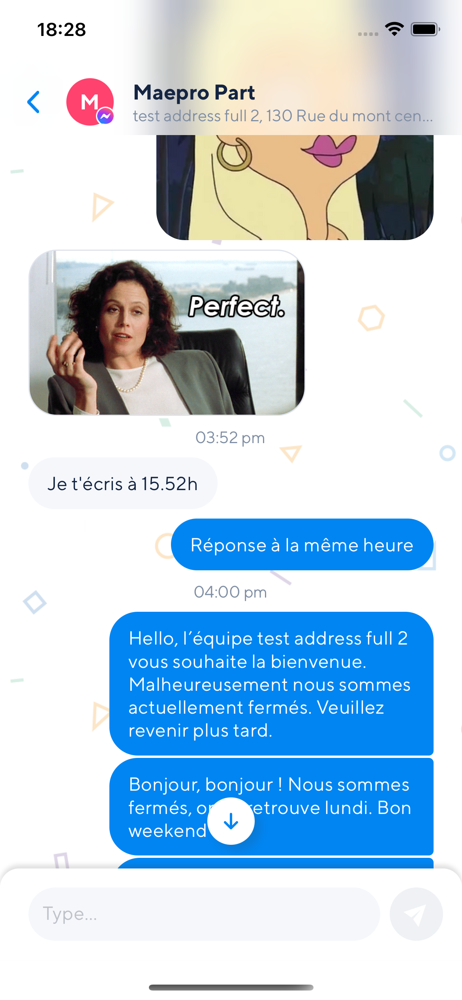

# `rn-id-blurview`

A component for UIVisualEffectView's blur effect on iOS, and [BlurView](https://github.com/Dimezis/BlurView) on Android.<br>



### Content

- [`rn-id-blurview`](#rn-id-blurview)
    - [Content](#content)
    - [Installation](#installation)
    - [BlurView](#blurview)
    - [Android](#android)
    - [Workaround for android](#workaround-for-android)
    - [Troubleshooting](#troubleshooting)
    - [Questions?](#questions)

### Installation

1. Install the library using either Yarn:

```
yarn add rn-id-blurview
```

or npm:

```
npm install --save rn-id-blurview
```

2. Link your native dependencies:

```
react-native link rn-id-blurview
```

3. (iOS only) Install to Xcode:

```
cd ios
pod install
```

4. (Android only, optional)
If you've defined _[project-wide properties](https://developer.android.com/studio/build/gradle-tips.html)_ (**recommended**) in your root `build.gradle`, this library will detect the presence of the following properties:

```groovy
buildscript {...}
allprojects {...}

/**
  + Project-wide Gradle configuration properties
  */
ext {
    compileSdkVersion   = 27
    targetSdkVersion    = 27
    buildToolsVersion   = "27.0.3"
}
```

5. Include the library in your code:

```javascript
import { BlurView } from "rn-id-blurview";
```

6. Compile and have fun!

### BlurView

**Properties:**

- `blurType` (String)
  - `xlight` - extra light blur type
  - `light` - light blur type
  - `dark` - dark blur type
  - `extraDark` - extra dark blur type (tvOS only)
  - `regular` - regular blur type (iOS 10+ and tvOS only)
  - `prominent` - prominent blur type (iOS 10+ and tvOS only)
  - iOS 13 only Blur types:
    - `chromeMaterial` - An adaptable blur effect that creates the appearance of the system chrome.
    - `material` - An adaptable blur effect that creates the appearance of a material with normal thickness.
    - `thickMaterial` - An adaptable blur effect that creates the appearance of a material that is thicker than normal.
    - `thinMaterial` - An adaptable blur effect that creates the appearance of an ultra-thin material.
    - `ultraThinMaterial` - An adaptable blur effect that creates the appearance of an ultra-thin material.
    - `chromeMaterialDark` - A blur effect that creates the appearance of an ultra-thin material and is always dark.
    - `materialDark` - A blur effect that creates the appearance of a thin material and is always dark.
    - `thickMaterialDark` - A blur effect that creates the appearance of a material with normal thickness and is always dark.
    - `thinMaterialDark` - A blur effect that creates the appearance of a material that is thicker than normal and is always dark.
    - `ultraThinMaterialDark` - A blur effect that creates the appearance of the system chrome and is always dark.
    - `chromeMaterialLight` - An adaptable blur effect that creates the appearance of the system chrome.
    - `materialLight` - An adaptable blur effect that creates the appearance of a material with normal thickness.
    - `thickMaterialLight` - An adaptable blur effect that creates the appearance of a material that is thicker than normal.
    - `thinMaterialLight` - An adaptable blur effect that creates the appearance of a thin material.
    - `ultraThinMaterialLight` - An adaptable blur effect that creates the appearance of an ultra-thin material.
- `blurAmount` (Default: 10, Number)
  - `0-100` - Adjusts blur intensity
- `reducedTransparencyFallbackColor` (Color) (iOS only)
  - `black, white, #rrggbb, etc` - background color to use if accessibility setting ReduceTransparency is enabled

> Note: The maximum `blurAmount` on Android is 32, so higher values will be clamped to 32.

> Complete usage example that works on iOS and Android:

```javascript
import React, { Component } from "react";
import { View, Image, Text, StyleSheet } from "react-native";
import { BlurView } from "rn-id-blurview";

export default class Menu extends Component {

  render() {
    return (
      <View style={styles.container}>
        <Image
          key={'blurryImage'}
          source={{ uri }}
          style={styles.absolute}
        />
        <Text style={styles.absolute}>Hi, I am some blurred text</Text>
{/* in terms of positioning and zIndex-ing everything before the BlurView will be blurred */}
        <BlurView
          style={styles.absolute}
          viewRef={this.state.viewRef}
          blurType="light"
          blurAmount={10}
          reducedTransparencyFallbackColor="white"
        />
        <Text>I'm the non blurred text because I got rendered on top of the BlurView</Text>
      </View>
    );
  }
}

const styles = StyleSheet.create({
  container: {
    justifyContent: "center",
    alignItems: "center"
  },
  absolute: {
    position: "absolute",
    top: 0,
    left: 0,
    bottom: 0,
    right: 0
  }
});
```

In this example, the `Image` component will be blurred, because the `BlurView` in positioned on top. But the `Text` will stay unblurred.

If the [accessibility setting `Reduce Transparency`](https://support.apple.com/guide/iphone/display-settings-iph3e2e1fb0/ios) is enabled the `BlurView` will use `reducedTransparencyFallbackColor` as it's background color rather than blurring. If no `reducedTransparencyFallbackColor` is provided, the`BlurView`will use the default fallback color (white, black, or grey depending on `blurType`)

### Android

Android uses the [BlurView](https://github.com/Dimezis/BlurView).

If you only need to support iOS, then you can safely ignore these limitations.

In addition to `blurType` and `blurAmount`, Android has some extra props that can be used to override the default behavior (or configure Android-specific behavior):

- `blurRadius` (Number - between 0 and 25) - Manually adjust the blur radius. (Default: matches iOS blurAmount)
- `downsampleFactor` (Number - between 0 and 25) - Scales down the image before blurring (Default: matches iOS blurAmount)
- `overlayColor` (Color) - Set a custom overlay color (Default color based on iOS blurType)
### Workaround for android
```javascript
  <View style={{backgroundColor: preferedColorForAndroidONParent}}>
    <BlurView
      blurType="light"
      blurAmount={15}
      style={StyleSheet.absoluteFill}
      key={isIOS ? 'blur' : Math.random().toString()}
      overlayColor={Platform.select({ android: Color.Transparent, ios: Color.White70 })}
    />
  </View>
```
### Troubleshooting

On older instances of react-native, BlurView package does not get added into the MainActivity/MainApplication classes where you would see `Warning: Native component for 'BlurView' does not exist` in RN YellowBox or console.

To rectify this, you can add the BlurViewPackage manually in MainActivity/MainApplication classes

```java
...
import com.cmcewen.blurview.BlurViewPackage;
...

public class MainApplication extends Application implements ReactApplication {
...
    @Override
    protected List<ReactPackage> getPackages() {
      return Arrays.<ReactPackage>asList(
          new MainReactPackage(),
          new BlurViewPackage()
      );
    }
...
}
```

### Questions?

Feel free to contact me on [linkedin](https://www.linkedin.com/in/idris-sakhi-304713a9/) or [create an issue](https://github.com/idrisssakhi/blurView/issues)
